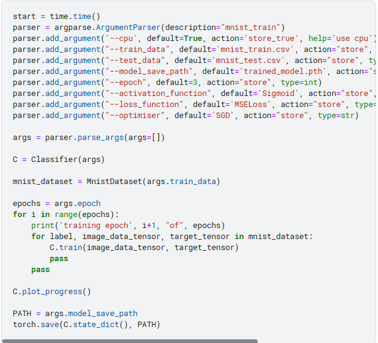
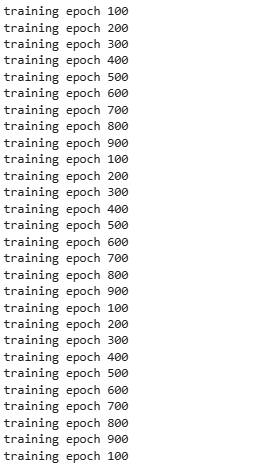
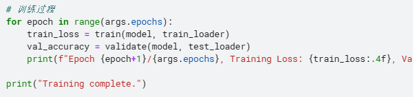
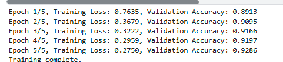
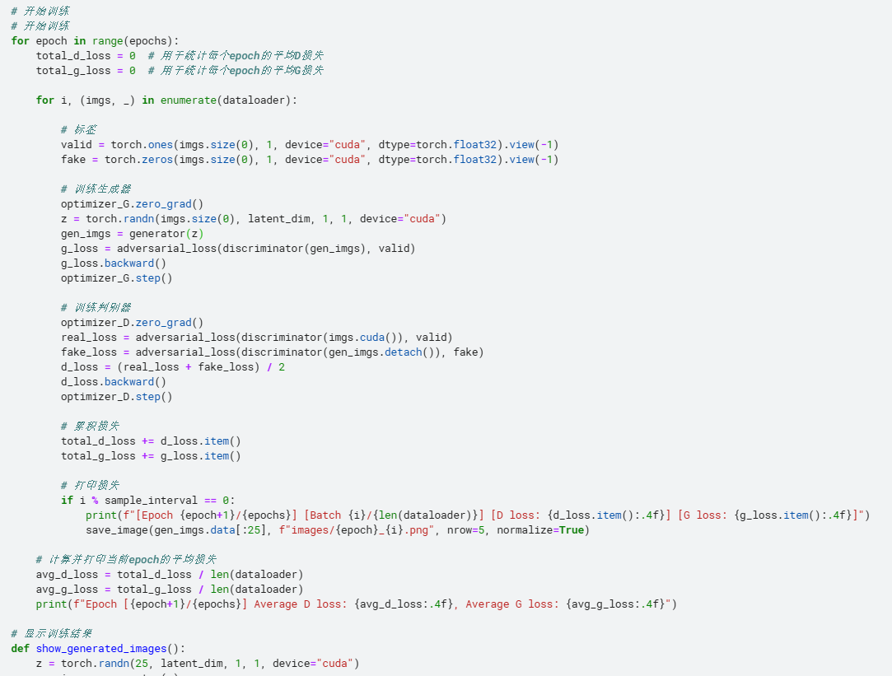
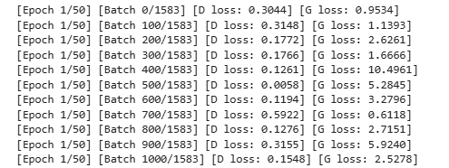

# 作业一、实验环境搭建与典型应用认知

## 一、环境搭建
由于设备在之前已经配置`pyotorch`,`Anaconda`与`cudnn-cpu`，故跳过环境搭建。

## 二、Mnist数据集载入

* 从`mnist_dataset`数据集导入，并显示其中一个数字
* 可以观察到，本数据集中的数字由一个个像素点组成。在`pytorch`中的表现形式是一个二维张量(可以在后续打印矩阵中观察到)
  

* 从矩阵中观察数据集特征
* 在矩阵中，颜色越接近白色，数值越小。白色的色块数值为`0.00`

## 三、用基础参数训练  

* 训练过程  

* 查看损失函数  

## 四、测试  

## 五、GAN网络训练人脸数据
### 5.1 建立训练模型
* 本实验的主要问题是`CelebA`人脸图像数据集太大，大小约为`1.4GB`，在云端平台训练需要将图片打包为`.zip`格式
* 加载数据集的时间约为`18min`

### 5.2 开始训练
* 由于本机没有GPU，故为了训练效果，使用云端GPU `T4`（最大显存为32GB），总训练时长约`100min`
* 在前一个小时的训练中，发现GPU使用时间和显存远远小于CPU和内存，原因可能是自己的设备太旧或云端传输原因

### 5.3 训练结果

